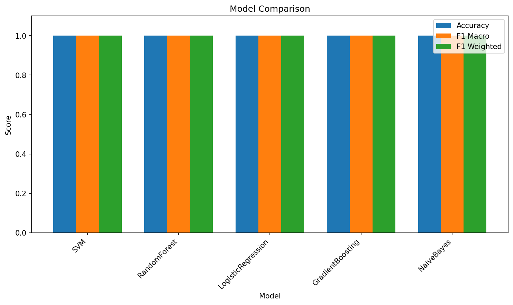
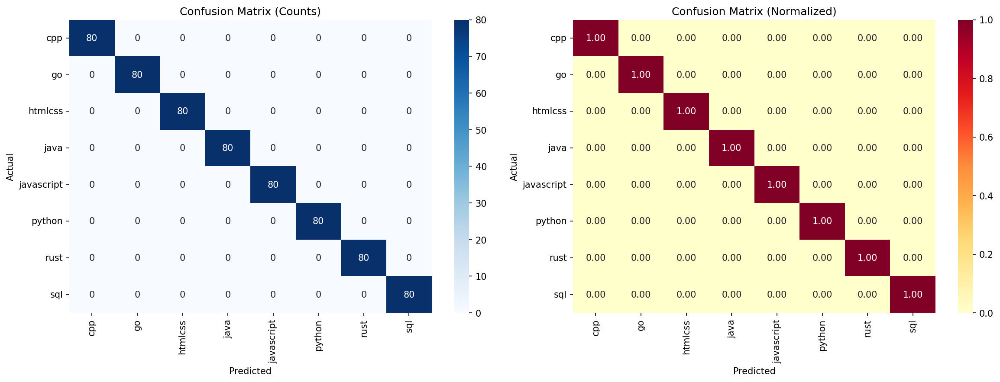

# Проект 8. Автоматическое определение языка программирования в сниппетах кода

## Описание

Многоклассовая классификация фрагментов кода по языку программирования с использованием методов машинного обучения.

### Классы (языки программирования):
- Python
- JavaScript
- Java
- C++
- Go
- Rust
- SQL
- HTML/CSS


## Ход решения

### 1. Сбор сниппетов кода с фильтрацией по тегам языков

Данные собираются из нескольких источников:
- **Kaggle**: реальные решения задач (Python, C++) из датасетов `data_python.csv` и `data_cpp.csv`
- **Синтетические данные**: генерируются шаблоны кода для JavaScript, Java, Go, Rust, SQL, HTML/CSS
- **CodeSearchNet**: сниппеты кода с GitHub (альтернативный источник)

Функция `collect_data()` поддерживает параметры:
- `source="kaggle"` — загрузка из Kaggle CSV файлов
- `source="synthetic"` — генерация синтетических данных
- `source="codesearchnet"` — загрузка из CodeSearchNet

### 2. Очистка

Функция `clean_code()` выполняет:
- Удаление однострочных и многострочных комментариев
- Удаление многострочных строковых литералов
- Удаление лишних пустых строк и пробелов
- Нормализация whitespace

### 3. Токенизация

Функция `tokenize()` разбивает код на токены с помощью регулярных выражений:
- Идентификаторы: `[a-zA-Z_]\w*`
- Числа: `\d+\.\d+|\d+`
- Операторы: `[+\-*/=<>!&|]`
- Скобки и разделители: `[\(\)\{\}\[\];,.:]`

Векторизация через **TF-IDF** (Term Frequency-Inverse Document Frequency):
- `max_features=5000` — максимальное количество признаков
- `ngram_range=(1, 2)` — унарные и бинарные n-граммы
- `sublinear_tf=True` — логарифмическая TF

### 4. Построение базовой модели

Используются 5 классификаторов:

| Модель | Параметры | Описание |
|--------|-----------|----------|
| SVM | kernel='rbf', C=1.0 | Support Vector Machine с RBF ядром |
| RandomForest | n_estimators=200 | Случайный лес из 200 деревьев |
| LogisticRegression | max_iter=1000 | Логистическая регрессия |
| GradientBoosting | n_estimators=100 | Градиентный бустинг |
| NaiveBayes | — | MultinomialNB для TF-IDF признаков |

### 5. Настройка и обучение предобученной модели

CodeBERT:
- Предобученная модель `microsoft/CodeBERT-base-v1`
- Fine-tuning на нашем датасете
- Использует HuggingFace Transformers API
- Поддерживает обучение с W&B логгингом

### 6. Оценка

#### Метрики:
- **Accuracy** — доля правильных предсказаний
- **Precision** — точность (какая доля предсказанных классов верна)
- **Recall** — полнота (какая доля реальных объектов найдена)
- **F1-score** — гармоническое среднее precision и recall

#### Анализ confusion matrix:
- Визуализация матрицы путаницы
- Анализ наиболее частых ошибок
- Специальный анализ путаницы между Java/C++

#### Ручная проверка:
- Тестирование на вручную выбранных примерах
- Визуальная проверка правильности классификации

## Структура проекта
```
project/
├── main.py                    # Главный скрипт запуска
├── requirements.txt           # Зависимости Python
├── README.md                  # Этот файл
├── src/
│   ├── __init__.py
│   ├── data_collection.py     # Сбор данных (синтетический + внешние источники)
│   ├── preprocessing.py       # Очистка, токенизация, TF-IDF
│   ├── model_baseline.py      # Базовые модели (SVM, RF, LR, NB)
│   ├── model_advanced.py      # Продвинутая модель (CodeBERT)
│   ├── evaluation.py          # Оценка и визуализация
│   └── utils.py               # Вспомогательные функции
├── data/
│   ├── raw/                   # Сырые данные
│   └── processed/             # Предобработанные данные
├── models/                    # Сохранённые модели
├── results/                   # Результаты оценки и графики
└── notebooks/                 # Jupyter ноутбуки для экспериментов
```

## Установка

1. **Создайте виртуальное окружение:**
```bash
python -m venv venv
source venv/bin/activate  # На Windows: venv\Scripts\activate
```

2. **Установите зависимости:**
```bash
pip install -r requirements.txt
```

## Использование

### Быстрый старт

Запустите полный пайплайн:
```bash
python main.py
```

### Пошаговое использование

#### 1. Сбор данных

**Вариант А: Синтетические данные (по умолчанию)**
```python
from src.data_collection import collect_data
df = collect_data(source="synthetic")
```

**Вариант Б: CodeSearchNet (реальные данные из GitHub)**
```bash
# Скачайте данные
pip install requests
python download_codesearchnet.py

# Распакуйте (пример для Python)
tar -xzf data/raw/codesearchnet/codesearchnet-data-python.tar.gz -C data/raw/codesearchnet/
```

```python
from src.data_collection import collect_data
df = collect_data(source="codesearchnet")
```

**Вариант В: Свой CSV**
Создайте `data/raw/code_data.csv` с колонками `code` и `language`:
```python
df = collect_data(source="kaggle")
```

#### 2. Предобработка
```python
from src.preprocessing import preprocess_data

X_train, X_test, y_train, y_test, classes = preprocess_data(df)
```

#### 3. Обучение базовой модели
```python
from src.model_baseline import BaselineModel

model = BaselineModel()
model.train(X_train, y_train, classes)
results = model.evaluate(X_test, y_test, classes)
```

#### 4. Обучение CodeBERT
```python
from src.model_advanced import CodeBERTClassifier

classifier = CodeBERTClassifier(num_classes=8)
classifier.train(train_texts, train_labels, epochs=3, batch_size=16)
```

#### 5. Оценка
```python
from src.evaluation import (
    evaluate_model,
    analyze_confusion_matrix,
    plot_model_comparison,
    manual_check
)

# Анализ матрицы путаницы
analyze_confusion_matrix(cm, classes, save_path="results/confusion_matrix.png")

# Сравнение моделей
plot_model_comparison(results_list, save_path="results/model_comparison.png")
```

## Метрики оценки

- **Accuracy** — общая точность
- **Precision/Recall/F1** — по каждому классу и в среднем
- **Confusion Matrix** — матрица путаницы для анализа ошибок
- **Кросс-валидация** — 5-fold CV для надёжной оценки

## Источники данных

### Рекомендуемые датасеты:

1. **CodeSearchNet** — сниппеты кода с GitHub
   - https://github.com/github/CodeSearchNet

2. **Kaggle Code Datasets**
   - https://www.kaggle.com/datasets?search=code+language

3. **GitHub Archive** — архив данных GitHub
   - https://www.gharchive.org/

### Формат данных:
```csv
code,language
"def hello():\n    print('world')",python
"console.log('hello');",javascript
```

## Результаты

После запуска проекта в папке `results/` будут созданы:
- `model_comparison.csv` — сравнение моделей
- `confusion_matrix.png` — матрица путаницы
- `model_comparison.png` — график сравнения моделей
- `{model_name}_report.json` — отчёт по каждой модели

### Визуализация результатов

#### Сравнение моделей



График показывает Accuracy, F1 Macro и F1 Weighted для каждой из 5 обученных моделей.

#### Матрица путаницы



Левая часть — абсолютные значения, правая — нормализованные (доли). Показывает, как часто модель путает одни языки с другими.

## Настройка модели

### Hyperparameter Tuning
```python
from sklearn.model_selection import GridSearchCV

param_grid = {
    'C': [0.1, 1, 10, 100],
    'kernel': ['linear', 'rbf', 'poly']
}
grid_search = GridSearchCV(SVC(), param_grid, cv=5)
```

## Требования

- Python 3.9+
- scikit-learn >= 1.3.0
- pandas >= 2.0.0
- torch >= 2.1.0 (для CodeBERT)
- transformers >= 4.35.0 (для CodeBERT)